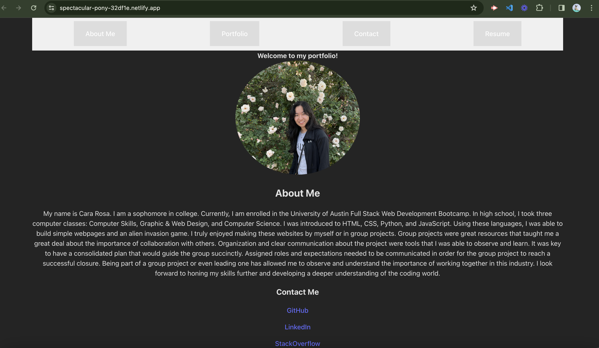

# React Portfolio

## Description

The React Portfolio encompasses an overview of my education (About Me), my portfolio, my resume, and a form users can submit to contact me. The About Me section goes in depth about previous classes I have taken in school. The Portfolio section highlights webpages I have created or refactored during the UT bootcamp. The Resume section lists skills I have learned during this bootcamp.

## Installation

Users can fork this repository. Link to the deployed application to Netlify: [ReactPortfolio](https://spectacular-pony-32df1e.netlify.app/)

Screenshots of the project are below:

## Credits

I used React documentation to create the Portfolio section. I changed the code in order to display images as a link with a photo. Linked is the website to React documenation: [React Website](https://react.dev/). The teacher, Hubert, and the TA, Ethan, were able to help me deploy my application to Netlify.